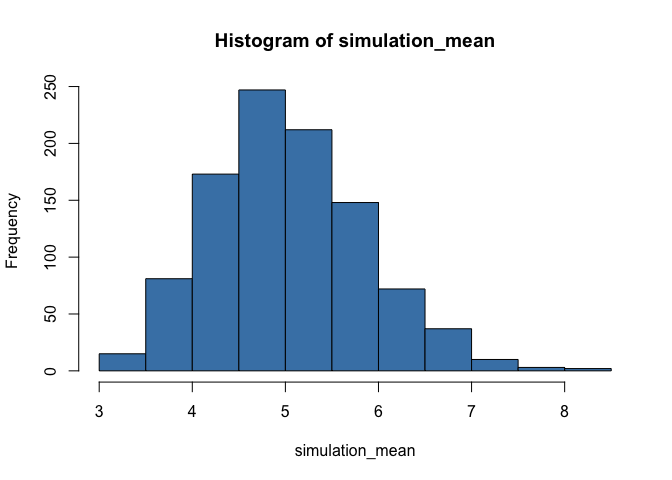

# CourseProject

Muralidhar Areti  
Jul 26, 2015  

## Overview
In this project you will investigate the exponential distribution in R and compare it with the Central Limit Theorem. The exponential distribution can be simulated in R with rexp(n, lambda) where lambda is the rate parameter. The mean of exponential distribution is 1/lambda and the standard deviation is also 1/lambda. **Set lambda = 0.2 for all of the simulations.** You will investigate the distribution of averages of 40 exponentials. Note that you will need to do a thousand simulations.

## Simulations

```r
suppressPackageStartupMessages(library(dplyr))
library(ggplot2)
```

To sumulation data is generated using the `rexp(n,lambda)` function and storing the results into a matrix. We build a histogram to show a distribution of the means.  


```r
set.seed(5)
n = 40
lambda = 0.2
simulations = 1000

simulation_data = matrix(rexp(simulations*n, lambda), simulations)
simulation_mean = apply(simulation_data, 1, mean)
hist(simulation_mean, col="steelblue")
```

 

## Sample Mean vs. Theoretical Mean
The theoretical mean is calculated using the formula `1/lambda`. The sample mean is determined by evaluating the mean of our simulated data. 

```r
theoretical_mean = round(1/lambda, 3)
sample_mean = round(mean(simulation_mean), 3)
```

Measure | Value
---|---
Theoretical mean | 5  
Sample mean | 5.043  

## Sample Variance vs. Theoretical Variance
The theoretical variance is determined from the formula `(1/lambda)^2/n`. The standard deviation is the square root of the variance. Once more the simulation variance (and standard deviation) is determined from the simulation data. 


```r
theoretical_var = (1/lambda)^2/n
theoretical_sd = sqrt(theoretical_var)
```

Measure | Value
---|---
Theoretical Variance | 0.625
Simulation Variance | 0.679
Theoretical Standard Deviation | 0.791
Simulation Standard Deviation | 0.824


## Distribution 

```r
plot_data = data.frame(simulation_mean)

plot_data %>%
    ggplot(aes(x=simulation_mean)) + 
    geom_histogram(aes(y=..density..), fill="steelblue", colour="black") + 
    geom_density(size=1, colour="coral2") + 
    theme_bw()
```

```
## stat_bin: binwidth defaulted to range/30. Use 'binwidth = x' to adjust this.
```

 

The resulting distribution is skewed a little to the left but otherwise it resembles a bell curve. The peak of the bell curve is just below 5 which is very close to our theoretical means.  


End of File
