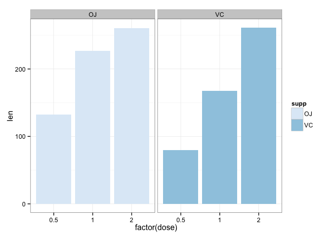

# Course Project II

Muralidhar Areti  
Jul 26, 2015

## Tooth Growth Data
The `ToothGrowth` data in `R` is a data frame of 60 observations with 3 variables that show the length of teeth in 10 guinea pigs provided with three dose levels of Vitamin C (0.5, 1 and 2mg) with each of two delivery methods, orange juice or ascorbic acid. 


```r
suppressPackageStartupMessages(library(dplyr))
library(ggplot2)
data(ToothGrowth)
```

## Summary of Data

```r
dim(ToothGrowth)
```

```
## [1] 60  3
```

```r
names(ToothGrowth)
```

```
## [1] "len"  "supp" "dose"
```

```r
str(ToothGrowth)
```

```
## 'data.frame':	60 obs. of  3 variables:
##  $ len : num  4.2 11.5 7.3 5.8 6.4 10 11.2 11.2 5.2 7 ...
##  $ supp: Factor w/ 2 levels "OJ","VC": 2 2 2 2 2 2 2 2 2 2 ...
##  $ dose: num  0.5 0.5 0.5 0.5 0.5 0.5 0.5 0.5 0.5 0.5 ...
```

```r
summary(ToothGrowth)
```

```
##       len        supp         dose      
##  Min.   : 4.20   OJ:30   Min.   :0.500  
##  1st Qu.:13.07   VC:30   1st Qu.:0.500  
##  Median :19.25           Median :1.000  
##  Mean   :18.81           Mean   :1.167  
##  3rd Qu.:25.27           3rd Qu.:2.000  
##  Max.   :33.90           Max.   :2.000
```

```r
head(ToothGrowth)
```

```
##    len supp dose
## 1  4.2   VC  0.5
## 2 11.5   VC  0.5
## 3  7.3   VC  0.5
## 4  5.8   VC  0.5
## 5  6.4   VC  0.5
## 6 10.0   VC  0.5
```

## Comparison of Tooth Growth by supp and dose

```r
ToothGrowth %>%
    ggplot(aes(x=factor(dose), y=len, fill=supp)) +
    geom_bar(stat="identity") +
    facet_grid(. ~ supp) + 
    scale_fill_brewer() +
    theme_bw()
```

 


```r
ToothGrowth %>%
    ggplot(aes(x=factor(dose), y=len, fill=supp)) + 
    geom_boxplot() + 
    facet_grid(. ~ supp) + 
    scale_fill_brewer() + 
    theme_bw()
```

 

## Conclusion


End of File
