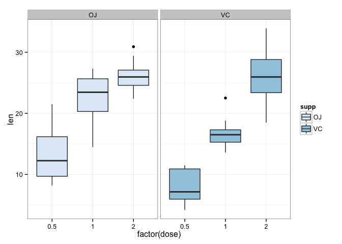

# Course Project II

Muralidhar Areti  
Jul 26, 2015

## Tooth Growth Data
The `ToothGrowth` data in `R` is a data frame of 60 observations with 3 variables that show the length of teeth in 10 guinea pigs provided with three dose levels of Vitamin C (0.5, 1 and 2mg) with each of two delivery methods, orange juice or ascorbic acid. 


```r
suppressPackageStartupMessages(library(dplyr))
library(ggplot2)
data(ToothGrowth)
```

## Summary of Data
A preliminary exploration of the data better helps us understand what we are working with to allow us to perform analysis on the data. 

```r
dim(ToothGrowth)
```

```
## [1] 60  3
```

```r
names(ToothGrowth)
```

```
## [1] "len"  "supp" "dose"
```

```r
str(ToothGrowth)
```

```
## 'data.frame':	60 obs. of  3 variables:
##  $ len : num  4.2 11.5 7.3 5.8 6.4 10 11.2 11.2 5.2 7 ...
##  $ supp: Factor w/ 2 levels "OJ","VC": 2 2 2 2 2 2 2 2 2 2 ...
##  $ dose: num  0.5 0.5 0.5 0.5 0.5 0.5 0.5 0.5 0.5 0.5 ...
```

```r
summary(ToothGrowth)
```

```
##       len        supp         dose      
##  Min.   : 4.20   OJ:30   Min.   :0.500  
##  1st Qu.:13.07   VC:30   1st Qu.:0.500  
##  Median :19.25           Median :1.000  
##  Mean   :18.81           Mean   :1.167  
##  3rd Qu.:25.27           3rd Qu.:2.000  
##  Max.   :33.90           Max.   :2.000
```

```r
head(ToothGrowth)
```

```
##    len supp dose
## 1  4.2   VC  0.5
## 2 11.5   VC  0.5
## 3  7.3   VC  0.5
## 4  5.8   VC  0.5
## 5  6.4   VC  0.5
## 6 10.0   VC  0.5
```

## Comparison of Tooth Growth by supp and dose
The first chart shows a comparison of the supplement types of the length versus the dose.  


```r
ToothGrowth %>%
    ggplot(aes(x=factor(dose), y=len, fill=supp)) +
    geom_bar(stat="identity") +
    facet_grid(. ~ supp) + 
    scale_fill_brewer() +
    theme_bw()
```

 

The chart above shows a direct relationship between the lengths and the factors, i.e. higher doses will provide longer lengths. Additionally, orange juice overall produced longer teeth.  

The next chart shows the same data represented as box plots. This shows the variability in the data and provides a more accurate representation of the results than simply previewing the length. 


```r
ToothGrowth %>%
    ggplot(aes(x=factor(dose), y=len, fill=supp)) + 
    geom_boxplot() + 
    facet_grid(. ~ supp) + 
    scale_fill_brewer() + 
    theme_bw()
```

 

From the box plot the general conclusion is similar as our first chart but now we can see more variability within the data. 

We can use a regression analysis to determine the effect supplement types have on tooth length, i.e. how much of the variance is because of the supplement type?


```r
fit = lm(len ~ dose+supp, data=ToothGrowth)
summary(fit)
```

```
## 
## Call:
## lm(formula = len ~ dose + supp, data = ToothGrowth)
## 
## Residuals:
##    Min     1Q Median     3Q    Max 
## -6.600 -3.700  0.373  2.116  8.800 
## 
## Coefficients:
##             Estimate Std. Error t value Pr(>|t|)    
## (Intercept)   9.2725     1.2824   7.231 1.31e-09 ***
## dose          9.7636     0.8768  11.135 6.31e-16 ***
## suppVC       -3.7000     1.0936  -3.383   0.0013 ** 
## ---
## Signif. codes:  0 '***' 0.001 '**' 0.01 '*' 0.05 '.' 0.1 ' ' 1
## 
## Residual standard error: 4.236 on 57 degrees of freedom
## Multiple R-squared:  0.7038,	Adjusted R-squared:  0.6934 
## F-statistic: 67.72 on 2 and 57 DF,  p-value: 8.716e-16
```


```r
confint(fit)
```

```
##                 2.5 %    97.5 %
## (Intercept)  6.704608 11.840392
## dose         8.007741 11.519402
## suppVC      -5.889905 -1.510095
```

This function gives a 95% confidence interval which provides the limits for which we can expect 95% of results from future experiemnts to fall in. 

## Conclusion
These findings tell us that there is indeed an impact of the supplement types and the winner is OJ!

End of File
